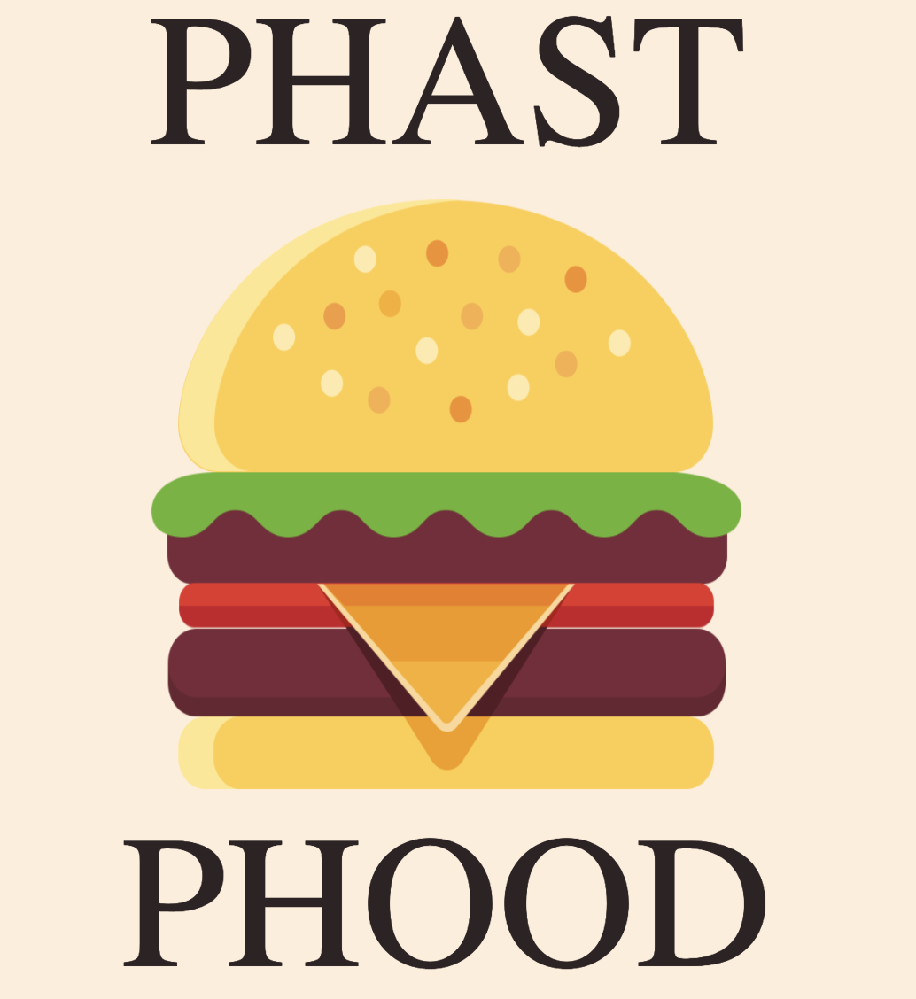

# Welcome to Phast Phood!

  

Our app is designed to get you to the recipes you want, without making you scroll through a novel first. Don’t care what you eat, as long as it has bacon in it? Try out our search by ingredient function to get some recipe ideas. If you have a particular dish in mind, go ahead and just search for that recipe.

front end - https://github.com/James-Harkins/fast_food  
back end - https://github.com/mcharrod/fast_food_backend  

[Phast Phood](phastphood.herokuapp.com) -- take a look!

___Languages and Technologies___  
-- Ruby -- Ruby on Rails -- Bootstrap -- Google Oauth -- HTML -- REST --  
-- API -- RSPEC -- CSS -- Heroku Deployment -- Git/Github --

___App Structure___  
This particular app is actually made up of two different rails apps: one for the front end, and one for the backend. Our backend app makes external API calls to The Meal DB and preserves the data while altering the formatting to optimize it for our front - end app. The
```
===Backend App===
Our app uses the endpoints provided by The Meal DB.  
The back end was to preserve the data coming through those
endpoints while altering the formatting to optimize it for front-end.
```
```
===Frontend App===

The front end app is responsible for the OAuth log in exchange with
Google which gives users the ability to register using their existing
Gmail account. Our front end app is responsible for displaying the data
given back to us from our API and is stylized using Bootstrap.
```
___Project Endpoints___  
Search meal by name  
/api/v1/recipe/search?q=“pizza”  

Lookup full meal details by id  
/api/v1/recipe/find?id=1123  

Lookup a single random meal  
/api/v1/recipe/random_meal  

Filter by main ingredient  
/api/v1/recipe/ingredient?q=“onion”

Filter by Category  
/api/v1/recipe/category?q=“dessert”  

Filter by Area  
/api/v1/recipe/area?q=“italy”  

Find User  
GET /api/v1/user?email=“jon@gmail.com”  

New User  
POST /api/v1/users  

Update User  
PATCH /api/v1/user?id=“123"  

Delete User  
DELETE /api/v1/user?id=“123”

___APIs / Outside Credits___  
[The Cocktail DB](https://www.thecocktaildb.com/api.php)  
[The Meal DB](https://www.themealdb.com/api.php)  
[Lovepik](https://lovepik.com/images/png-food.html) - Food Png Vectors

___Contributors___  
James Harkins - https://github.com/James-Harkins  
  

Alex Randolph - https://github.com/AlexGrandolph  
  

Katy Harrod - https://github.com/mcharrod  
  

Reuben Davison - https://github.com/Reuben-Davison  
  

Luke Pascale - https://github.com/enalihai  

